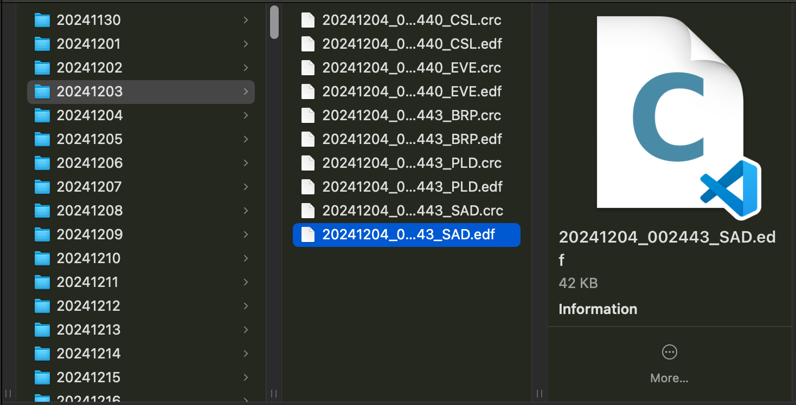

# Sleep Study

## An exploration of my personal sleep data on the open internet. What could go wrong?

## Disclaimer

I AM NOT A MEDICAL PROFESSIONAL AND THIS IS NOT MEDICAL ADVICE. THIS IS SOMETHING I AM DOING IN THE INTERESTS OF MY OWN EXPLORATION AND UNDERSTANDING. PLEASE DO NOT INTERPRET ANYTHING EXISTING IN THIS REPOSITORY OR THAT IS LINKED TO BY THIS REPOSITORY AS MEDICAL ADVICE. CONSULT WITH A QUALIFIED MEDICAL PROFESSIONAL BEFORE TAKING ANY ACTION BASED ON ANY INFORMATION HEREIN.

## Not a Disclaimer But Still Something I Want To Mention

If you are affiliated with an employer and reading this, please forgive my sardonic stylings in any of the text of this project, and please understand that I'm doing it for a couple reasons. For one, my hope is that by writing in a casual familiar tone, I can assuage the idea that I just used an LLM to write all this up. 

## Why would you do this?

This is a project in which I look into my own sleep data to see how my now year-long journey with my CPAP has gone, and what can be done to improve it.

## Where I Got My Data

I got my data from my data from my own personal ResMed Airsense 10 Autoset that I got about a year ago. While previously I was tracking everything I did through the MyAir app, I soon remembered that I'm a data scientist, and that I don't need some crazy app compiling my data for me, and in December of 2024 I stuck an SD card in the thing so I could use it regularly. There are likely some gaps between usages (there was an issue where the SD card popped out of the slot, but did not visibly disturb the waterproof cover), but the data I collected should be an accurate representation of what I have.

## Data Aggregation

After a few months of data collection, it was time to face my next hurdle. How the heck do they actually store this data?

Short answer: horrifyingly

Long answer:

Like a lot of medical devices of varying types, my CPAP uses the [European Data Format(EDF)](https://en.wikipedia.org/wiki/European_Data_Format) first established in 1992 and later expanded on in 2003 with EDF+. Based on trying to load this data in manually using a python library ([PyEDFlib](https://pyedflib.readthedocs.io/en/latest/) for the curious) and getting a bewildering `OSError: /Volumes/CPAP/DATALOG/20241130/20241201_092814_CSL.edf: The file is discontinuous and cannot be read`, I take it that my CPAP uses EDF+, which allows for such features (or at least that's what Wikipedia says). 

While I can certainly say that I have a certain amount of interest in the various ways different fields have found to meet their specific needs, I don't really have a lot of interest in detangling the specifics of this particular file format on my own when that isn't a significant part of my project. Thankfully, in the grand tradition of just about every computation-related problem ever, somebody else already did the work and has a better solution than I could ever come up with. Enter [OSCAR](https://www.sleepfiles.com/OSCAR/)

OSCAR is a piece of FOSS that allows you to look at apnea data. It is cross-platform, is compatible with a variety of manufacturers. The user interface is actually very well designed and can give you a lot of really good insights. If you're a CPAP user of any technical persuasion, I would actually highly recommend you take a look at it, and maybe even consider donating to offset their server costs.

The thing I will be using OSCAR is that it has a wonderful export tool which takes your raw data and compiles it into a CSV. If you want to plug in your own data into my notebook, select the "Detail" option, which will give you a raw flow of events from the system.

## Okay, so you got your data. Can I see it?

No. As you can probably imagine, there are a lot of reasons someone wouldn't want their data on a public repository associated with their name in a country with private health insurance (though I'm reasonably certain that info is out there somewhere).

I'm comfortable enough showing the high-level summaries and a few fields, but I'm not just going to publish a detailed description of my entire sleep history. Ultimately, I would like to build a probably overcomplicated model to simulate the data, but I'm just going to label that 

**\[COMING SOON (maybe)\]**

## Enough yammering

Okay, let's get into some analysis. Meet me over at the Jupyter notebook!

